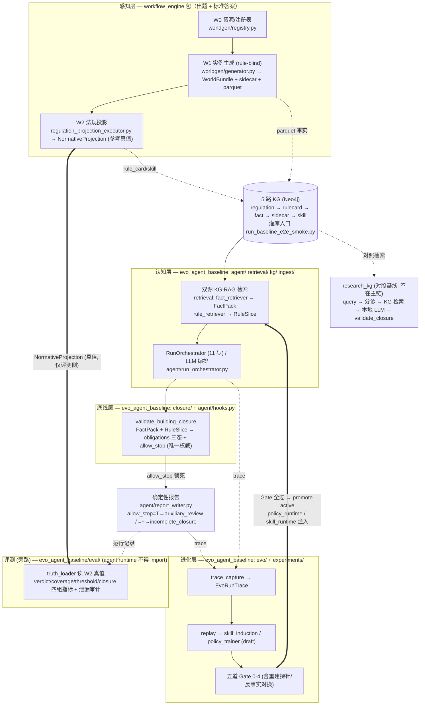

# 架构总图（ARCHITECTURE）

> 这是 evo-agent v1 的**端到端鸟瞰**——把三篇人工架构导航（各说一个包）拼成一张全局图。
> 想看某个包的内部细节，点进对应的 _overview；想跑起来，看 [`QUICKSTART.md`](QUICKSTART.md)；
> 黑话查 [`glossary.md`](glossary.md)。
>
> - [`api/evo_agent_baseline_overview.md`](api/evo_agent_baseline_overview.md) —— 认知 / 底线 / 进化层 + 评测旁路
> - [`api/workflow_engine_overview.md`](api/workflow_engine_overview.md) —— W0/W1/W2 数据生成 + 法规投影
> - [`api/research_kg_overview.md`](api/research_kg_overview.md) —— 对照用的双源 KG-RAG 检索基线（**不在主链**）

---

## 1. 三包 ↔ 四层 ↔ 数据流总图

四层架构（感知 / 认知 / 底线 / 进化）+ 评测旁路，落在三个活包上。下图是一栋楼从"数据生成"
到"出合规报告 + 评测 + 进化反馈"的完整链路（实线 = 主数据流；虚线 = 旁路 / 反馈）。

> 渲染说明：用 mermaid `flowchart`。粗箭头（`==>`）标关键约束流（W2 真值仅入评测侧 / Gate
> 通过才注入回认知层）；虚线（`-.`）标旁路与反馈；普通实线是主数据流。不支持 mermaid 的
> 阅读器可看 §2 的文字描述串起同一条链。

---

## 2. 三个包怎么咬合成一条端到端链

跟着一栋楼走一遍（确定性模式为例）：

1. **感知层（`workflow_engine`）出题 + 标准答案**。`worldgen` 按 W0 注册表 + 物理公式
   生成建筑实例（W1，rule-blind），落 `WorldBundle` + sidecar + parquet；W2 在 W1 之上做
   per-fragment 法规投影，产 `NormativeProjection` **参考真值**。全链总入口
   `run_worldgenerator_fullcoverage_framework_v2`（一函数 7 步串齐 W0+W1+W2）。
   详见 [workflow_engine overview](api/workflow_engine_overview.md) §3.1。

2. **灌 5 路 KG**。把 W1 事实、法规原文、rule_card、sidecar、seed 技能按固定顺序
   `regulation → rulecard → fact → sidecar → skill` 灌进 Neo4j（loader 在
   `evo_agent_baseline.ingest`，一键编排入口 `run_baseline_e2e_smoke.py`）。
   **关键约束**：W2 的 `NormativeProjection` **不灌进 agent 的检索图**——它只走评测侧。

3. **认知层（`evo_agent_baseline`: `agent`/`retrieval`/`kg`/`ingest`）检索 + 编排**。
   `RunOrchestrator.run(world_id, building_id)` 走 11 步：经依赖注入的 `retrieval_fn`
   做双源 KG-RAG 检索（建筑事实 → `FactPack`、候选规则打分排序 → `RuleSlice`），LLM-as-brain
   模式下由 LLM 决定工具调度顺序 + 写报告。检索结果过 `post_retrieval_source_audit`
   守卫（DTO 不得含 W2 字段）。详见 [evo_agent_baseline overview](api/evo_agent_baseline_overview.md) §3.1–3.2。

4. **底线层（`closure/` + `agent/hooks.py`）确定性判定**。
   `validate_building_closure(rule_slice, fact_pack, config)` 纯 Python 算出每条
   obligation 的三态（open / blocked / satisfied）+ `ClosureSummary` + **唯一权威的
   `allow_stop`**。`post_verifier_stop_gate` 锁死 `allow_stop`：LLM / 编排 / 技能 / 策略
   都不能改。即使 LLM 拒调闭包，finalize 前也强制跑一次验证器。

5. **出报告**。`report_writer` 按 `allow_stop` 渲染确定性报告
   （True → `auxiliary_review_report.md`，False → `incomplete_closure_notice.md`），
   过 `pre_output_language_guard`（禁"最终不合规"等越权话术），持久化成
   `ComplianceAssessmentRun`。

6. **评测（旁路，`eval/`）**。离线阅卷读 W2 `NormativeProjection` 真值，跑
   verdict / coverage / threshold / closure 四组指标 + 泄漏审计，出评测 JSON。
   **blind 红线**：`agent` runtime **不得 import `eval`**、不碰 evaluator truth store
   —— 真值只在这条旁路可见。

7. **进化层（`evo/` + `experiments/`）反馈回认知层**。运行时 `trace_capture` 把每步落成
   `EvoRunTrace`；`replay` 聚合重复失败/成功模式；`skill_induction` / `policy_trainer`
   产 draft 技能/策略；过**五道 Gate**（含 artifact 端重建探针 / 反事实对换审计）才
   promote 成 active，经 `policy_runtime` / `skill_runtime` **注入回第 3 步的检索排序 +
   工具顺序**（跑得越多越会）。**进化层不变量**：技能/策略只影响检索排序 + 工具顺序 +
   报告结构，**绝不**改 `allow_stop` / `closure_status` / `satisfaction_status`。
   详见 [evo_agent_baseline overview](api/evo_agent_baseline_overview.md) §3.4。

---

## 3. research_kg 是对照基线，不在主链上

`research_kg` 不是上面这条主链的一环。它是**固定参照系**——用一句缺陷描述跑
"链路分诊 → KG 检索召回 → 本地 LLM 抽事实+选规则 → 闭包核验"的端到端最小流程，用来跟
进化版 / 路由辅助版拉对比。它复用 `workflow_engine` 的轻量闭包评估
（`validate_closure`，**不是**底线层权威的 `validate_building_closure`），同样不读 W2
真值（保 blind）。细节见 [research_kg overview](api/research_kg_overview.md)。

> 自进化（evo）在 `evo_agent_baseline` 包；`research_kg` 只负责"对照"。两者别混。

---

## 4. 怎么跑 / 看哪份文档

- **先跑起来** → [`QUICKSTART.md`](QUICKSTART.md)（§2 零依赖 mock 路径已实测；§3 真实全链路
  四步：生成数据 → 灌库 → 跑 agent → 评测）。
- **逐函数签名 / pydantic 字段** → [`api/index.md`](api/index.md)（AST 自动抽取）。
- **黑话** → [`glossary.md`](glossary.md)。
- **跑实验 / 归档约定** → [`experiments/README.md`](experiments/README.md)。
